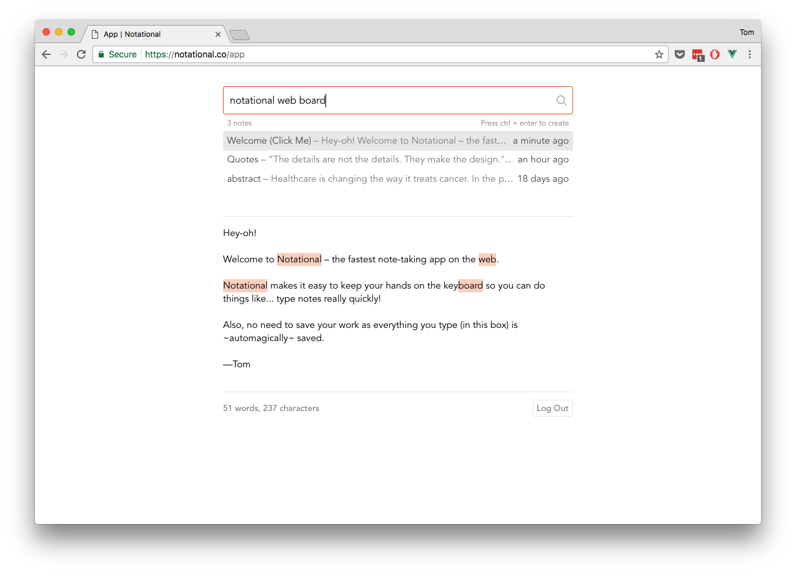

# Notational, notes at the speed of thought.

Notational encourages you to keep your hands on the keyboard so you can create, update, and find notes really quickly. The UX is based on the popular macOS app, [Notational Velocity](http://notational.net/) (but not affiliated in any way).



## Firebase Setup

Notational uses Firebase (it's [pretty abstracted so it could change](https://github.com/tmm/notational/blob/master/src/store/api.js)). You can spin up your own instance for testing or local development. [Check out this issue for more info.](https://github.com/tmm/notational/issues/3)

You will also need to create a `settings.js` file in the root directory that contains your [Firebase](https://firebase.google.com/) information:

```js
const ENV = {
	firebase: {
	    apiKey: "XXXXXXXXXXXXXXXXXXXXXXXXXXXXXXXXXXXXXXX",
	    authDomain: "YOUR-APP-NAME.firebaseapp.com",
	    databaseURL: "https://YOUR-APP-NAME.firebaseio.com",
	    storageBucket: "YOUR-APP-NAME.appspot.com",
	    messagingSenderId: "XXXXXXXXXXXX"
	}
}

export default ENV
global.ENV = ENV
```

The initial DB schema should look like the following (`default_notes` is the only required key-value pair):

```js
{
  "default_notes" : {
    "notes" : [ {
      "body" : "Hey-oh!\n\nWelcome to Notational – the fastest note-taking app on the web.\n\nNotational makes it easy to keep your hands on the keyboard so you can do things like... type notes really quickly! (See *Useful Shortcuts* above.)\n\nAlso, no need to save your work as everything you type (in this box) is ~automagically~ saved.\n\n—Tom",
      "date_created" : "Sun Mar 05 2017 18:15:27 GMT-0500",
      "date_modified" : "Sun Mar 05 2017 18:25:02 GMT-0500",
      "id" : 1,
      "name" : "Welcome (Click Me)"
    },
    ...
    ]
  },
  "public_notes" : {
  	// Will be auto created
  },
  "users" : {
  	// Will be auto created
  }
}
```

## Build Setup

``` bash
# install dependencies
npm install

# serve with hot reload at localhost:8080
npm run dev

# build for production with minification
npm run build

# deploy on Firebase
npm run deploy
```

## License

Released under the MIT license. See LICENSE for details.
